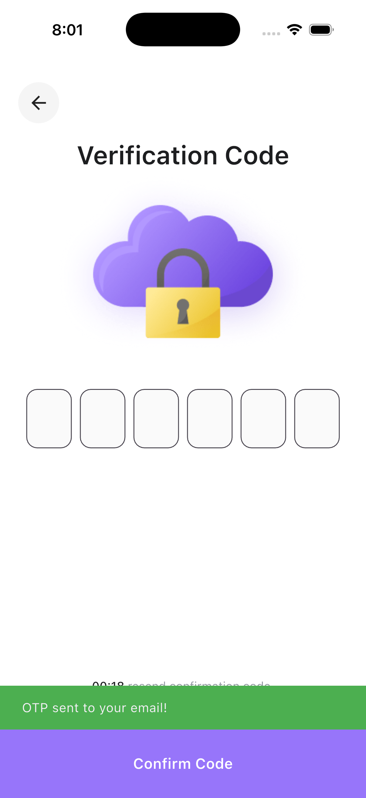

# Laza - E-commerce Application

<div align="center">


A complete Flutter e-commerce application implementing authentication, product browsing, shopping cart, reviews, and payment features with clean architecture principles.

[](https://flutter.dev)
[](https://dart.dev)
[](LICENSE)

[Features](#-features) • [Architecture](#-architecture) • [Setup](#-setup-instructions) • [Screenshots](#-screenshots) • [Demo](#-demo)

</div>

---

## 📱 Features

### Authentication
- **User Registration** - Create new account with username, email, and password
- **User Login** - Sign in with email and password
- **Social Login Options** - Facebook, Twitter, and Google authentication UI
- **Forgot Password Flow** - Complete password recovery system:
  - Email verification
  - 6-digit OTP validation
  - New password creation
- **User Profile & Info Integration** - Comprehensive user information management:
  - Retrieve authenticated user information from API
  - Display user profile data (username, email, etc.)
  - Persistent user session management
  - Secure token-based authentication for user info requests

### Home & Products
- **Product Catalog** - Browse all available products
- **Product Search** - Search products by name or keyword with real-time filtering
- **Product Filter** - Filter products dynamically in search bar as you type
- **Product Details** - View detailed product information:
  - Product images 
  - Price, description, and specifications
  - Size selection
  - Add to cart functionality
- **Category Browsing** - Filter products by categories (Adidas, Nike, Fila, Puma, etc.)
- **New Arrivals** - Display latest products
- **Brand Section** - Browse products by popular brands

### Reviews & Ratings
- **View Reviews** - See all customer reviews for products
- **Add Reviews** - Submit product reviews with ratings
- **Review Statistics** - Average ratings and review counts

### Shopping Cart
- **Add to Cart** - Add products with selected size and quantity
- **Cart Management** - View all cart items
- **Update Quantity** - Increase/decrease item quantities
- **Remove Items** - Delete items from cart
- **Clear Cart** - Remove all items at once
- **Price Calculation** - Automatic total price calculation

### Payment & Checkout
- **Payment Methods** - Support for multiple payment options:
  - Credit/Debit cards (Visa, Mastercard)
  - PayPal
- **Add New Card** - Save payment card details
- **Order Confirmation** - Order success screen

### UI/UX Features
- **Onboarding** - Welcome screen with gender selection
- **Splash Screen** - App launch screen
- **Bottom Navigation** - Easy navigation between main sections
- **Custom Drawer** - Side menu for additional options
- **Custom Widgets** - Reusable UI components:
  - Custom text fields
  - Elevated buttons
  - Icon buttons with background
  - Back button
  - Search bar
- **Smooth Animations** - Enhanced user experience with animations:
  - Slide and fade transition from home to product details screen
  - Interactive cart item animations on tap
  - Carousel slider for payment cards with smooth transitions
  - Animated route transitions throughout the app
- **Error Handling** - User-friendly error messages and retry options

## 🏗️ Architecture

This project follows **Clean Architecture** principles with three main layers:

### 1. Domain Layer (Business Logic)
- **Entities**: Pure Dart classes representing business models
- **Repositories**: Abstract interfaces defining contracts
- **Use Cases**: Business logic implementation (single responsibility)

### 2. Data Layer (Data Management)
- **Models**: JSON-serializable data classes extending domain entities
- **Data Sources**: API service implementations (Retrofit)
- **Repository Implementations**: Concrete implementations of domain repositories
- **Local Storage**: SharedPreferences for caching

### 3. Presentation Layer (UI)
- **Screens**: UI components and layouts
- **Cubits**: State management logic (BLoC pattern)
- **States**: UI state definitions
- **Widgets**: Reusable UI components

### Project Structure

```
lib/
├── core/
│   ├── common_ui/           # Reusable widgets
│   │   └── widgets/
│   │       ├── app_elevated_button.dart
│   │       ├── app_text_field.dart
│   │       ├── bottom_action_button.dart
│   │       ├── bottom_navigation.dart
│   │       ├── custom_back_button.dart
│   │       ├── custom_drawer.dart
│   │       ├── custom_icon_with_bg.dart
│   │       └── custom_text_field.dart
│   ├── constants/           # App constants and assets
│   ├── error/              # Error handling
│   ├── networking/         # API client setup
│   │   ├── api_constants.dart
│   │   ├── api_error_handler.dart
│   │   └── dio_client.dart
│   ├── routing/           # Navigation configuration
│   │   ├── app_router.dart
│   │   ├── routes.dart
│   │   └── router_transitions.dart
│   ├── theming/          # App theme
│   │   ├── app_colors.dart
│   │   └── app_themes.dart
│   ├── utils/            # Utility classes
│   ├── di.dart           # Dependency injection
│   └── shared_prefs.dart # Shared preferences helper
│
└── features/
    ├── auth/            # Authentication feature
    │   ├── domain/
    │   │   ├── entities/
    │   │   ├── repositories/
    │   │   └── use_cases/
    │   ├── data/
    │   │   ├── models/
    │   │   ├── data_sources/
    │   │   └── repositories/
    │   └── presentation/
    │       ├── screens/
    │       │   ├── forgot_password_screen.dart
    │       │   ├── login_options_screen.dart
    │       │   ├── login_screen.dart
    │       │   ├── new_password_screen.dart
    │       │   ├── signup_screen.dart
    │       │   └── verification_code_screen.dart
    │       ├── cubit/
    │       └── widgets/
    │
    ├── home/            # Products, Categories & Reviews
    │   ├── domain/
    │   ├── data/
    │   └── presentation/
    │       ├── screens/
    │       │   ├── home_screen.dart
    │       │   ├── product_details_screen.dart
    │       │   ├── category_products_screen.dart
    │       │   ├── reviews_screen.dart
    │       │   └── add_review_screen.dart
    │       ├── cubit/
    │       │   ├── product_cubit/
    │       │   ├── category_cubit/
    │       │   ├── review_cubit/
    │       │   └── category_products/
    │       └── widgets/
    │
    ├── cart/            # Shopping cart feature
    │   ├── domain/
    │   ├── data/
    │   │   ├── data_sources/
    │   │   │   ├── cart_local_data_source.dart
    │   │   │   ├── cart_remote_data_source.dart
    │   │   │   └── cart_api_service.dart
    │   │   ├── models/
    │   │   └── repositories/
    │   └── presentation/
    │       ├── screens/
    │       │   ├── cart_screen.dart
    │       │   └── order_confirmed_screen.dart
    │       └── cubit/
    │
    ├── payment/         # Payment feature
    │   └── presentation/
    │       └── screens/
    │           ├── payment_screen.dart
    │           └── add_new_card_screen.dart
    │
    ├── onboarding/      # Onboarding feature
    │   └── presentation/
    │       ├── screens/
    │       └── widgets/
    │
    └── splash/          # Splash screen
        └── presentation/
            └── screens/
```

## 🛠️ Tech Stack

### Core Dependencies
- **Flutter** - UI framework
- **Dart SDK** ^3.9.2

### State Management
- **flutter_bloc** (^9.1.1) - BLoC/Cubit pattern for state management


### Networking
- **dio** (^5.9.0) - HTTP client for API calls
- **retrofit** (^4.7.3) - Type-safe HTTP client generator
- **json_annotation** (^4.9.0) - JSON serialization annotations

### Dependency Injection
- **get_it** (^8.2.0) - Service locator for dependency injection

### Navigation
- **go_router** (^16.2.4) - Declarative routing solution

### Data & Logic
- **equatable** (^2.0.7) - Value equality for entities and states
- **dartz** (^0.10.1) - Functional programming (Either for error handling)
- **shared_preferences** (^2.5.3) - Local data persistence

### UI Components
- **carousel_slider** (^5.1.1) - Image carousel for product details
- **flutter_svg** (^2.2.1) - SVG image support

### Development Tools
- **build_runner** (^2.9.0) - Code generation
- **json_serializable** (^6.11.1) - JSON serialization code generation
- **retrofit_generator** (^10.0.6) - Retrofit implementation generation
- **flutter_lints** (^5.0.0) - Linting rules

## 🚀 How to Run the App

### Prerequisites
- **Flutter SDK**: Version 3.9.2 or higher
- **Dart SDK**: Version 3.9.2 or higher
- **IDE**: Android Studio, VS Code, or IntelliJ IDEA with Flutter plugins
- **Device**: iOS simulator, Android emulator, or physical device
- **Internet Connection**: Required for API calls

### Step-by-Step Installation

1. **Clone the repository**
   ```bash
   git clone https://github.com/Riyam224/laza-ecommerce.git
   cd laza-ecommerce
   ```

2. **Verify Flutter installation**
   ```bash
   flutter doctor
   ```
   Ensure all checkmarks are green. Fix any issues before proceeding.

3. **Install dependencies**
   ```bash
   flutter pub get
   ```

4. **Generate code for JSON serialization and Retrofit**
   ```bash
   dart run build_runner build --delete-conflicting-outputs
   ```
   This generates the necessary `.g.dart` files for JSON serialization and API services.

5. **Check connected devices**
   ```bash
   flutter devices
   ```

6. **Run the app**

   For development (debug mode):
   ```bash
   flutter run
   ```

   For specific device:
   ```bash
   # iOS Simulator
   flutter run -d "iPhone 15 Pro"

   # Android Emulator
   flutter run -d emulator-5554

   # Physical device
   flutter run -d <device-id>
   ```

   For release mode (better performance):
   ```bash
   flutter run --release
   ```

7. **Hot Reload during development**
   - Press `r` in the terminal to hot reload
   - Press `R` to hot restart
   - Press `q` to quit

### Troubleshooting

If you encounter build errors:
```bash
# Clean the project
flutter clean

# Get dependencies again
flutter pub get

# Regenerate code
dart run build_runner build --delete-conflicting-outputs

# Run again
flutter run
```

If code generation fails:
```bash
# Try with cache deletion
dart run build_runner build --delete-conflicting-outputs

# Or watch mode for continuous generation
dart run build_runner watch --delete-conflicting-outputs
```

## 🌐 API Configuration

### Base URL
```dart
https://accessories-eshop.runasp.net/api/
```

### Authentication Endpoints

| Method | Endpoint | Description |
|--------|----------|-------------|
| POST | `/auth/register` | Create new user account |
| POST | `/auth/login` | Sign in existing user |
| POST | `/auth/forgot-password` | Send OTP to email |
| POST | `/auth/validate-otp` | Verify OTP code |
| POST | `/auth/reset-password` | Set new password |
| GET | `/auth/user-info` | Get user information |

### Product Endpoints

| Method | Endpoint | Description |
|--------|----------|-------------|
| GET | `/products` | Get all products (with pagination) |
| GET | `/products/{id}` | Get product by ID |
| GET | `/products/search?query={query}` | Search products |
| GET | `/categories` | Get all categories |
| GET | `/products/category/{categoryId}` | Get products by category |

### Review Endpoints

| Method | Endpoint | Description |
|--------|----------|-------------|
| GET | `/products/{id}/reviews` | Get product reviews |
| POST | `/reviews` | Add new review |

### Cart Endpoints

| Method | Endpoint | Description |
|--------|----------|-------------|
| GET | `/cart` | Get cart items |
| POST | `/cart/add` | Add item to cart |
| PUT | `/cart/update` | Update cart item quantity |
| DELETE | `/cart/remove/{id}` | Remove item from cart |
| DELETE | `/cart/clear` | Clear all cart items |

## 🎯 State Management

### BLoC Pattern Implementation

Each feature uses **Cubit** for state management following this pattern:

```dart
// 1. Define states
sealed class ProductState extends Equatable {}

class ProductInitial extends ProductState {}

class ProductLoading extends ProductState {}

class ProductLoaded extends ProductState {
  final List<ProductEntity> products;
  ProductLoaded(this.products);
}

class ProductError extends ProductState {
  final String message;
  ProductError(this.message);
}

// 2. Implement Cubit
class ProductCubit extends Cubit<ProductState> {
  final GetProductsUseCase getProductsUseCase;

  ProductCubit(this.getProductsUseCase) : super(ProductInitial());

  Future<void> getProducts() async {
    emit(ProductLoading());
    try {
      final products = await getProductsUseCase();
      emit(ProductLoaded(products));
    } catch (e) {
      emit(ProductError(e.toString()));
    }
  }
}
```

### Using in UI

```dart
BlocProvider(
  create: (context) => sl<ProductCubit>()..getProducts(),
  child: BlocBuilder<ProductCubit, ProductState>(
    builder: (context, state) {
      if (state is ProductLoading) {
        return const CircularProgressIndicator();
      }
      if (state is ProductLoaded) {
        return ProductsList(products: state.products);
      }
      if (state is ProductError) {
        return ErrorWidget(message: state.message);
      }
      return const SizedBox.shrink();
    },
  ),
)
```

## 🔧 Dependency Injection

Using **get_it** for dependency injection with layered registration:

```dart
// 1. Core dependencies
await _setupCore();  // Dio, SharedPreferences

// 2. Feature dependencies
_setupAuth();        // Auth API, Repository, Use Cases, Cubits
_setupProducts();    // Product API, Repository, Use Cases, Cubits
_setupCart();        // Cart API, Repository, Use Cases, Cubits
```

### Registration Example

```dart
void _setupProducts() {
  // Data Source
  sl.registerLazySingleton<ProductRemoteDataSource>(
    () => ProductRemoteDataSource(sl())
  );

  // Repository
  sl.registerLazySingleton<ProductRepository>(
    () => ProductRepositoryImpl(sl())
  );

  // Use Cases
  sl.registerLazySingleton(() => GetProductsUseCase(sl()));
  sl.registerLazySingleton(() => GetProductByIdUseCase(sl()));

  // Cubits (Factory for multiple instances)
  sl.registerFactory(() => ProductCubit(sl()));
}
```

## 🧭 Navigation

Using **go_router** for declarative routing:

```dart
final router = GoRouter(
  initialLocation: AppRoutes.splash,
  routes: [
    GoRoute(path: AppRoutes.splash, builder: (context, state) => const SplashScreen()),
    GoRoute(path: AppRoutes.onboarding, builder: (context, state) => const OnboardingScreen()),
    GoRoute(path: AppRoutes.login, builder: (context, state) => const LoginScreen()),
    GoRoute(path: AppRoutes.home, builder: (context, state) => const HomeScreen()),
    GoRoute(path: AppRoutes.productDetails, builder: (context, state) => ProductDetailsScreen(productId: state.extra)),
    GoRoute(path: AppRoutes.cart, builder: (context, state) => const CartScreen()),
    // ... more routes
  ],
);
```

### Available Routes

- `/` - Root
- `/splash` - Splash screen
- `/onboarding` - Onboarding with gender selection
- `/loginOptions` - Login options (social login)
- `/login` - Login screen
- `/signup` - Signup screen
- `/forgetPassword` - Forgot password
- `/verificationCode` - OTP verification
- `/newPassword` - Reset password
- `/home` - Home screen
- `/productDetails` - Product details
- `/reviews` - Product reviews
- `/addReview` - Add review
- `/cart` - Shopping cart
- `/payment` - Payment methods
- `/addNewCard` - Add payment card
- `/orderConfirmed` - Order confirmation
- `/categoryProducts` - Products by category

## 📦 Code Generation

This project uses code generation for:

### 1. JSON Serialization (`json_serializable`)
```dart
@JsonSerializable()
class ProductModel extends ProductEntity {
  // ...
  factory ProductModel.fromJson(Map<String, dynamic> json) =>
    _$ProductModelFromJson(json);

  Map<String, dynamic> toJson() => _$ProductModelToJson(this);
}
```

### 2. Retrofit API Service (`retrofit_generator`)
```dart
@RestApi()
abstract class ProductRemoteDataSource {
  factory ProductRemoteDataSource(Dio dio) = _ProductRemoteDataSource;

  @GET("products")
  Future<List<ProductModel>> getProducts();
}
```

### Running Code Generation

```bash
# Watch for changes and auto-generate
dart run build_runner watch

# One-time generation
dart run build_runner build --delete-conflicting-outputs

# Clean and regenerate
flutter clean
flutter pub get
dart run build_runner build --delete-conflicting-outputs
```

## 🎨 Theming & UI

### Color Palette
- Primary colors defined in [app_colors.dart](lib/core/theming/app_colors.dart)
- Theme configuration in [app_themes.dart](lib/core/theming/app_themes.dart)

### Reusable Widgets
- **AppElevatedButton** - Customizable elevated button
- **AppTextField** / **CustomTextField** - Form input fields
- **BottomNavWidget** - Bottom navigation bar
- **CustomDrawer** - Side navigation drawer
- **CustomBackButton** - Consistent back button
- **CustomIconWithBg** - Icon with background container
- **BottomActionButton** - Fixed bottom action button

### Assets
Images stored in `assets/images/`:
- Brand logos (Nike, Adidas, Fila, Puma)
- Social media icons (Facebook, Google, Twitter)
- UI icons (cart, search, heart, location, etc.)
- Payment icons (Visa, Mastercard, PayPal)
- Illustrations (onboarding, order confirmation, etc.)

**Asset Path Generation**: Using `flutter_assets` extension to automatically generate asset path constants:
```yaml
flutter_assets:
  assets_path: assets/images/
  output_path: lib/core/constants/
  filename: assets.dart
  field_prefix: resource
```
This generates type-safe asset references in [lib/core/constants/assets.dart](lib/core/constants/assets.dart), eliminating hardcoded string paths and preventing runtime errors from typos.

## 🔐 Authentication Flow

### Login Flow
1. User enters email and password
2. `LoginCubit` validates input
3. `LoginUseCase` calls `AuthRepository.login()`
4. `AuthRepositoryImpl` uses `AuthApiService` to make API call
5. On success: Store tokens → Navigate to home
6. On error: Display error message

### Registration Flow
1. User enters username, email, password
2. `RegisterCubit` validates input
3. `RegisterUseCase` calls repository
4. API returns authentication tokens
5. Store tokens → Navigate to home

### User Info Integration Flow

1. **Authentication**: User logs in successfully
2. **Token Storage**: Access token stored in SharedPreferences
3. **Fetch User Info**: Call `GET /auth/user-info` endpoint with Bearer token
4. **Data Processing**:
   - `GetUserInfoUseCase` retrieves user data from repository
   - `AuthRepositoryImpl` handles API communication
   - User model (username, email, profile data) returned
5. **State Management**: `UserInfoCubit` manages user info states
6. **UI Display**: User information displayed across the app (drawer, profile screen, etc.)
7. **Session Persistence**: User info cached locally for offline access

### Forgot Password Flow
1. **Email Entry** → Send OTP
2. **OTP Verification** → Validate code
3. **Password Reset** → Update password → Navigate to login

## 🛍️ Shopping Flow

### Browse & Add to Cart
1. Browse products on home screen
2. View product details with images
3. Select size and quantity
4. Add to cart (local or API)
5. Continue shopping or go to cart

### Checkout Process
1. Review cart items
2. Update quantities or remove items
3. Proceed to payment
4. Select payment method
5. Confirm order
6. View order confirmation

## 📊 Data Models

### Entity-Model Pattern

**Domain Entity** (Pure Dart):
```dart
class ProductEntity extends Equatable {
  final String id;
  final String name;
  final double price;
  final String description;

  const ProductEntity({
    required this.id,
    required this.name,
    required this.price,
    required this.description,
  });

  @override
  List<Object?> get props => [id, name, price, description];
}
```

**Data Model** (Extends Entity + JSON):
```dart
@JsonSerializable()
class ProductModel extends ProductEntity {
  const ProductModel({
    required super.id,
    required super.name,
    required super.price,
    required super.description,
  });

  factory ProductModel.fromJson(Map<String, dynamic> json) =>
    _$ProductModelFromJson(json);

  Map<String, dynamic> toJson() => _$ProductModelToJson(this);
}
```

## 🧪 Error Handling

### API Error Handling
- Centralized error handling in [api_error_handler.dart](lib/core/networking/api_error_handler.dart)
- User-friendly error messages in [error_messages.dart](lib/core/utils/error_messages.dart)
- Retry mechanisms for failed requests

### State-based Error Handling
```dart
if (state is ProductError) {
  return Column(
    children: [
      Text(state.message, style: TextStyle(color: Colors.red)),
      ElevatedButton(
        onPressed: () => context.read<ProductCubit>().getProducts(),
        child: const Text('Retry'),
      ),
    ],
  );
}
```

## 🧪 Testing

```bash
# Run all tests
flutter test

# Run specific test file
flutter test test/features/auth/login_test.dart

# Run with coverage
flutter test --coverage
```

## 🏗️ Building for Production

### Android
```bash
# Debug APK
flutter build apk --debug

# Release APK
flutter build apk --release

# App Bundle (for Play Store)
flutter build appbundle --release
```

### iOS
```bash
# Debug
flutter build ios --debug

# Release
flutter build ipa --release
```

## 📝 Development Guidelines

### Adding a New Feature

1. **Create Domain Layer**
   - Define entities in `domain/entities/`
   - Create repository interface in `domain/repositories/`
   - Implement use cases in `domain/use_cases/`

2. **Create Data Layer**
   - Create models extending entities in `data/models/`
   - Add API methods in `data/data_sources/`
   - Implement repository in `data/repositories/`
   - Run code generation

3. **Create Presentation Layer**
   - Define states in `presentation/cubit/`
   - Implement cubit logic
   - Create UI screens in `presentation/screens/`
   - Build reusable widgets in `presentation/widgets/`

4. **Register Dependencies**
   - Add to [core/di.dart](lib/core/di.dart)

5. **Add Routes**
   - Update [core/routing/routes.dart](lib/core/routing/routes.dart)
   - Update [core/routing/app_router.dart](lib/core/routing/app_router.dart)

### Code Style

- Use `const` constructors where possible
- Follow Flutter naming conventions (camelCase for variables, PascalCase for classes)
- Keep functions small and focused (single responsibility)
- Add comments for complex logic
- Use meaningful variable names
- Prefer composition over inheritance
- Use `Equatable` for value equality in entities and states

## ❓ Common Issues & Troubleshooting

### Issue: "Email not found" error

**Cause**: API endpoint path duplication

**Solution**: Ensure endpoints don't duplicate the base URL prefix:
```dart
// ❌ Wrong
@POST("api/auth/login")

// ✅ Correct
@POST("auth/login")
```

### Issue: Build runner fails

**Solution**:
```bash
flutter clean
flutter pub get
dart run build_runner build --delete-conflicting-outputs
```

### Issue: Dependency injection error

**Solution**: Ensure dependencies are registered in correct order:
1. Core (Dio, SharedPreferences)
2. API services
3. Repositories
4. Use cases
5. Cubits

### Issue: Navigation not working

**Solution**:
- Check route names in [routes.dart](lib/core/routing/routes.dart)
- Ensure routes are registered in [app_router.dart](lib/core/routing/app_router.dart)
- Use `context.go()` for replacement, `context.push()` for stacking

## 📚 Project Patterns & Best Practices

### Use Case Pattern
```dart
class GetProductsUseCase {
  final ProductRepository repository;

  GetProductsUseCase(this.repository);

  Future<List<ProductEntity>> call() async {
    return await repository.getProducts();
  }
}
```

### Repository Pattern
```dart
// Domain (Abstract)
abstract class ProductRepository {
  Future<List<ProductEntity>> getProducts();
}

// Data (Concrete)
class ProductRepositoryImpl implements ProductRepository {
  final ProductRemoteDataSource remoteDataSource;

  ProductRepositoryImpl(this.remoteDataSource);

  @override
  Future<List<ProductEntity>> getProducts() async {
    return await remoteDataSource.getProducts();
  }
}
```

### Either Pattern (Error Handling with Dartz)
```dart
Future<Either<Failure, ProductEntity>> getProduct(String id) async {
  try {
    final product = await remoteDataSource.getProduct(id);
    return Right(product);
  } catch (e) {
    return Left(ServerFailure(e.toString()));
  }
}
```

## 🤝 Contributing

1. Fork the repository
2. Create a feature branch (`git checkout -b feature/amazing-feature`)
3. Commit your changes (`git commit -m 'Add amazing feature'`)
4. Push to the branch (`git push origin feature/amazing-feature`)
5. Open a Pull Request

## 📷 Screenshots

### Onboarding & Authentication

<table>
  <tr>
    <td></td>
    <td></td>
    <td></td>
  </tr>
  <tr>
    <td align="center"><b>Onboarding</b></td>
    <td align="center"><b>Login Options</b></td>
    <td align="center"><b>Login</b></td>
  </tr>
</table>

<table>
  <tr>
    <td></td>
    <td></td>
    <td></td>
  </tr>
  <tr>
    <td align="center"><b>Sign Up</b></td>
    <td align="center"><b>OTP Verification</b></td>
    <td align="center"><b>New Password</b></td>
  </tr>
</table>

### Home & Products

<table>
  <tr>
    <td></td>
    <td></td>
    <td></td>
  </tr>
  <tr>
    <td align="center"><b>Home Screen</b></td>
    <td align="center"><b>Product Details</b></td>
    <td align="center"><b>Category Products</b></td>
  </tr>
</table>

### Reviews & Cart

<table>
  <tr>
    <td></td>
    <td></td>
    <td></td>
  </tr>
  <tr>
    <td align="center"><b>Product Reviews</b></td>
    <td align="center"><b>Add Review</b></td>
    <td align="center"><b>Shopping Cart</b></td>
  </tr>
</table>

### Payment & Order

<table>
  <tr>
    <td></td>
    <td></td>
    <td></td>
  </tr>
  <tr>
    <td align="center"><b>Delivery Address</b></td>
    <td align="center"><b>Payment Methods</b></td>
    <td align="center"><b>Add New Card</b></td>
  </tr>
</table>

<table>
  <tr>
    <td></td>
    <td></td>
  </tr>
  <tr>
    <td align="center"><b>Order Confirmed</b></td>
    <td align="center"><b>Navigation Drawer</b></td>
  </tr>
</table>

## 🎬 Demo

### Full App Walkthrough

<div align="center">


*Complete app walkthrough showing authentication, product browsing, cart, and payment features*

</div>

### Product Search & Filter

<div align="center">


*Real-time product search with dynamic filtering - type in the search bar to instantly filter products by name*

</div>

### Smooth Animations & Interactions

<div align="center">


*Interactive animations including:*
- *Slide & fade transition from home to product details*
- *Cart item tap animations for better user feedback*
- *Payment card carousel with smooth swipe transitions*

</div>

## 📋 Requirements

- **Flutter SDK**: 3.9.2 or higher
- **Dart SDK**: 3.9.2 or higher
- **IDE**: Android Studio, VS Code, or IntelliJ IDEA
- **Platforms**: iOS 12.0+, Android 5.0+ (API 21+)
- **Internet Connection**: Required for API calls

## 🔧 Configuration

### Environment Setup

1. **Flutter Installation**
   ```bash
   # Verify Flutter installation
   flutter --version

   # Check for issues
   flutter doctor
   ```

2. **IDE Setup**
   - Install Flutter and Dart plugins
   - Enable Dart analysis
   - Configure code formatter

### API Configuration

The app connects to a REST API backend. Configuration is in [lib/core/networking/api_constants.dart](lib/core/networking/api_constants.dart):

```dart
class ApiConstants {
  static const String baseUrl = 'https://accessories-eshop.runasp.net/api/';
  static const Duration connectionTimeout = Duration(seconds: 30);
  static const Duration receiveTimeout = Duration(seconds: 30);
}
```

### Local Storage

The app uses **SharedPreferences** for local data persistence:
- Authentication tokens (access & refresh tokens)
- User preferences
- Cart data (offline mode)

Configuration in [lib/core/shared_prefs.dart](lib/core/shared_prefs.dart)

### Code Generation Configuration

**build.yaml** (if needed):
```yaml
targets:
  $default:
    builders:
      json_serializable:
        options:
          explicit_to_json: true
```

## 📄 License

This project is part of the Flutter Mentorship program.

## 👨‍💻 Author

**Radhi**
Flutter Developer | Mentorship Program Week 4

## 📧 Contact

For questions or issues, please open an issue in the repository.

## 🙏 Acknowledgments

- Flutter & Dart teams for the amazing framework
- API backend: [accessories-eshop.runasp.net](https://accessories-eshop.runasp.net)
- All open-source package contributors

---

**Built with ❤️ using Flutter and Clean Architecture**

<div align="center">
  <sub>Made with Flutter • Clean Architecture • BLoC Pattern</sub>
</div>
